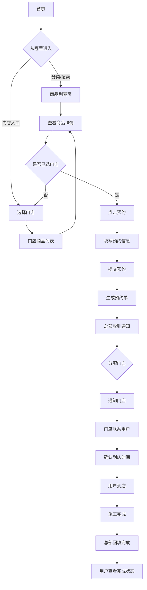
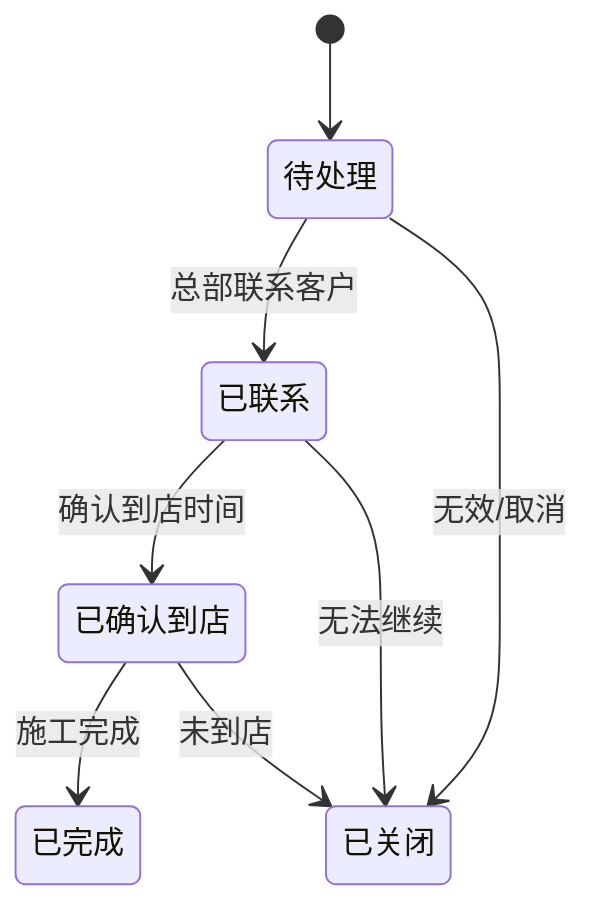
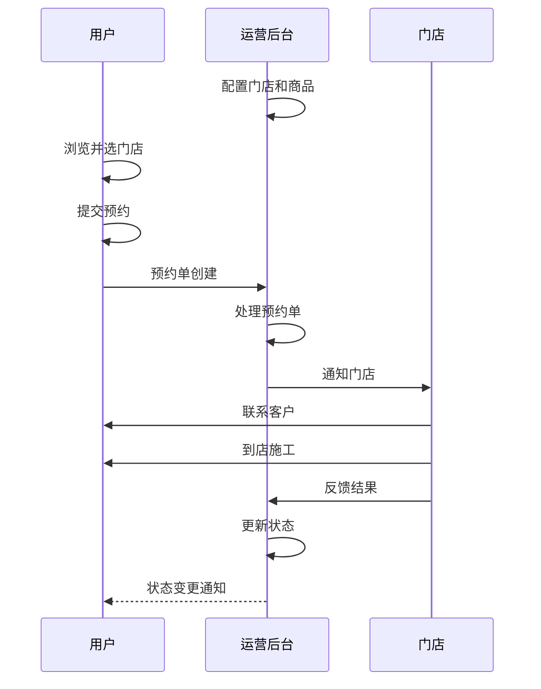

# PRD: 蓝辉轻改小程序 V1.1

**Author:** 蓝辉轻改团队
**Date:** 2026-05-15
**Status:** Draft
**Version:** 1.1
**Taskmaster Optimized:** Yes

---

## Table of Contents

1. [Executive Summary](#1-executive-summary)
2. [Problem Statement](#2-problem-statement)
3. [Goals & Success Metrics](#3-goals--success-metrics)
4. [User Stories](#4-user-stories)
5. [Functional Requirements](#5-functional-requirements)
6. [Non-Functional Requirements](#6-non-functional-requirements)
7. [Technical Considerations](#7-technical-considerations)
8. [Implementation Roadmap](#8-implementation-roadmap)
9. [Out of Scope](#9-out-of-scope)
10. [Open Questions & Risks](#10-open-questions--risks)
11. [Validation Checkpoints](#11-validation-checkpoints)
12. [Appendix: Task Breakdown Hints](#12-appendix-task-breakdown-hints)

---

## 1. Executive Summary

蓝辉轻改小程序是一个品牌+加盟商模式的预约到店型轻改装商城。通过小程序，用户可以线上了解轻改装项目、浏览分类与商品、选择门店、提交预约；品牌总部统一管理门店信息、商品配置和预约单处理；门店负责线下接待和施工服务。

第一阶段核心目标：打通"用户线上预约 → 总部处理分发 → 门店线下承接"的完整闭环，暂不涉及支付功能和门店后台系统。

用户端支持两条并存的浏览路径：
- 路径 A：先选商品，再选门店，再提交预约
- 路径 B：先选门店，再浏览该门店可承接商品，再提交预约

**Expected Impact:**
- 用户转化率提升：线上渠道获取更多潜在客户
- 运营效率提升：总部集中处理预约单，减少沟通成本
- 门店专注服务：门店无需系统操作，专注线下施工

### 1.1 需求清单收敛说明

本版本根据《蓝辉轻改小程序报价方案/需求清单》对 PRD 做范围补齐，吸收其中与产品功能直接相关的内容：用户端首页、分类页、商品详情、预约下单、门店页、我的页；后台端商品分类、商品、门店、预约订单、加盟、投诉建议、楼层分类标签、轮播图管理。

以下内容不直接进入核心产品需求，而进入商务、实施或运维文档管理：开发费用、付款方式、开发周期、人员配置、售后条款、服务器租赁费用、服务器规格和运维费用。报价清单中的 LAMP/LNMP、PHP 版本等环境建议需由技术负责人按当前代码仓库技术栈重新评估，不作为本 PRD 的强制技术约束。

如报价清单与本 PRD 冲突，以本 PRD 和后续确认的决策记录为准；如需调整上线范围，需由项目经理拆分为 P0/P1/P2 并更新任务清单。

---

## 2. Problem Statement

### 2.1 Current Situation

目前蓝辉轻改主要依赖线下自然客流和口碑传播，存在以下问题：

| 问题 | 现状描述 |
|------|----------|
| 获客渠道单一 | 主要依靠线下自然客流，线上流量未充分利用 |
| 信息不对称 | 用户不了解轻改装项目和门店能力，到店后才确认 |
| 预约流程缺失 | 用户到店才能确认服务意向，转化效率低 |
| 总部管控弱 | 门店服务和品牌标准难以统一管控 |

### 2.2 User Impact

**Who is affected:**
- **车主用户**：想了解轻改装项目但缺乏线上了解渠道，不知道选什么项目/门店
- **品牌总部**：有线上获客需求，但缺乏统一的用户触达和预约管理工具
- **加盟门店**：需要线上获客，但不想投入系统建设成本

**How they're affected:**
- 用户需要到店才能了解项目，决策成本高
- 总部无法统一管理线上预约，线下通知门店效率低
- 门店服务结果无法线上追溯，难以形成闭环

**Severity:** High — 影响品牌线上化转型的核心竞争力

### 2.3 Business Impact

- **Cost of problem:** 线上流量流失，门店空档率可能较高
- **Opportunity cost:** 抖音、小程序等线上渠道的潜在客户未被触达
- **Strategic importance:** 品牌数字化转型的第一步，为后续私域运营打下基础

### 2.4 Why Solve This Now?

- 线上渠道（抖音、小程序）已成为汽车后市场的重要获客来源
- 竞品已开始布局线上预约功能
- 技术方案可行，小程序生态成熟
- 第一阶段范围可控，适合快速验证

---

## 3. Goals & Success Metrics

### Goal 1: 用户线上预约流程打通

- **Description:** 用户能通过小程序完成从浏览项目到提交预约的完整流程
- **Metric:** 预约转化率（浏览用户 → 提交预约的比例）
- **Baseline:** 新功能无 baseline
- **Target:** 达到行业平均水平 3-5%
- **Timeframe:** 上线后第一个月
- **Measurement Method:** 小程序埋点数据统计

### Goal 2: 总部高效处理预约单

- **Description:** 总部能通过后台统一查看、处理预约单，并分发到对应门店
- **Metric:** 预约单平均处理时长
- **Baseline:** 无系统，纯线下处理
- **Target:** 预约单从提交到首次处理的时长 < 2小时
- **Timeframe:** 上线后第一个月
- **Measurement Method:** 后台日志记录

### Goal 3: 门店服务闭环

- **Description:** 用户到店施工完成后，预约单状态能完整更新
- **Metric:** 预约单完成率（已完成 / 总预约单）
- **Baseline:** 无数据
- **Target:** > 60%
- **Timeframe:** 上线后三个月
- **Measurement Method:** 后台预约单状态统计

### Goal 4: 首页内容灵活配置

- **Description:** 总部能通过后台配置首页展示内容，包括顶部/中部轮播图、楼层分类标签、热门项目、专题等
- **Metric:** 后台配置生效时间
- **Baseline:** 需开发修改
- **Target:** 配置修改后 < 5分钟生效
- **Timeframe:** 上线时
- **Measurement Method:** 后台操作日志

---

## 4. User Stories

### Story 1: 用户浏览首页

**As a** 有轻改装需求的车主，
**I want to** 在首页看到热门项目、案例和门店入口，
**So that I can** 快速了解品牌实力，找到感兴趣的内容。

**Acceptance Criteria:**
- [ ] 首页展示顶部 Banner 轮播图（可配置）
- [ ] 首页展示中部轮播图（可配置）
- [ ] 首页展示热门车型入口
- [ ] 首页展示热门商品推荐
- [ ] 首页支持楼层分类标签，每组默认展示 4 个标签
- [ ] 楼层分类下方展示对应商品/套餐列表，移动端默认一排 2 个卡片
- [ ] 商品卡片展示图片、标题、价格/价格说明、销量或推荐理由
- [ ] 首页支持进入分类页或搜索结果页，先浏览同类商品
- [ ] 首页展示门店入口
- [ ] 首页提供搜索入口
- [ ] 底部 Tab 包含：首页、分类、门店、我的
- [ ] 首页内容由总部后台配置
- [ ] 首页支持内容排序和上下线

**Task Breakdown Hint:**
- Task 1.1: 首页 UI 组件开发 (6h)
- Task 1.2: 后台首页内容配置功能 (8h)
- Task 1.3: 前后端数据绑定和接口对接 (6h)

**Dependencies:** None

---

### Story 2: 用户选择门店

**As a** 有轻改装需求的车主，
**I want to** 在需要预约或查看门店专属商品时选择服务门店，
**So that I can** 看到该门店真实可承接的项目和服务，并完成后续预约。

**Acceptance Criteria:**
- [ ] 门店页展示门店列表（名称、地址、电话、营业时间、距离）
- [ ] 门店页默认展示附近门店，并支持按距离从近到远排序
- [ ] 门店选择页支持按门店名称搜索
- [ ] 门店卡片支持拨打电话和定位导航
- [ ] 用户点击门店后记住当前服务门店
- [ ] 点击"进店选购"进入该门店商品页
- [ ] 门店商品页顶部展示当前门店名称、距离和营业时间
- [ ] 未选门店时可先浏览商品列表与商品详情
- [ ] 未选门店时不可直接完成预约提交，系统需引导先选择门店
- [ ] 用户从商品详情页进入选门店流程后，选完门店可回到原商品继续预约
- [ ] 从门店商品页进入预约提交时，默认带入当前门店

**Task Breakdown Hint:**
- Task 2.1: 门店列表页开发 (4h)
- Task 2.2: 门店选择状态管理 (2h)
- Task 2.3: 门店商品页权限校验 (2h)

**Dependencies:** REQ-001（门店数据管理）

---

### Story 3: 用户浏览门店商品

**As a** 已选择门店的车主，
**I want to** 按品牌/车型/分类筛选商品，
**So that I can** 快速找到目标项目或套餐。

**Acceptance Criteria:**
- [ ] 分类页顶部提供搜索框
- [ ] 分类页采用左侧一级分类 + 右侧二级分类图片区结构
- [ ] 二级分类图片区移动端默认一排 3 个
- [ ] 点击二级分类后进入该分类下的商品列表页
- [ ] 门店商品页只展示当前所选门店已上架商品
- [ ] 支持按品牌筛选
- [ ] 支持按车型筛选
- [ ] 支持按项目分类筛选（内饰、外观、功能、舒适、套餐）
- [ ] 商品列表页顶部提供搜索框
- [ ] 商品列表移动端默认一排 2 个卡片，展示图片、标题、价格、销量等
- [ ] 商品列表展示图片、名称、价格说明、简要介绍
- [ ] 点击商品进入商品详情页
- [ ] 分类页点击分类项后，可先进入同类商品列表页，再进入商品详情页
- [ ] 商品列表页支持价格、销量、品牌等排序/筛选入口

**Task Breakdown Hint:**
- Task 3.1: 门店商品列表页开发 (8h)
- [ ] Task 3.2: 筛选功能开发 (4h)
- [ ] Task 3.3: 套餐列表展示 (4h)

**Dependencies:** Story 2

---

### Story 4: 用户查看商品详情并预约

**As a** 找到感兴趣项目的车主，
**I want to** 查看商品详情并直接发起预约，
**So that I can** 快速将浏览意向转化为预约行动。

**Acceptance Criteria:**
- [ ] 商品详情页展示主图轮播
- [ ] 商品详情页展示标题、价格说明、产品标签、库存、销量
- [ ] 商品详情页展示项目介绍、适配车型、规格说明
- [ ] 商品存在规格时，用户需先选择规格再进入预约提交
- [ ] 商品详情页在已选门店时显示当前门店信息
- [ ] 商品详情页在未选门店时提示“请先选择服务门店”
- [ ] 商品详情页提供"加入预约单"入口
- [ ] 商品详情页底部操作包含：首页、立即预约
- [ ] 用户可先浏览商品详情，再在预约前选择门店
- [ ] 点击预约相关按钮时，若未选门店则先跳转门店选择页
- [ ] 选完门店后可返回原商品详情页继续预约
- [ ] 点击后进入预约单提交页
- [ ] 套餐详情页视为商品详情页的一种

**Task Breakdown Hint:**
- Task 4.1: 商品详情页开发 (8h)
- Task 4.2: 预约单提交页开发 (6h)
- Task 4.3: 套餐详情页开发 (4h)

**Dependencies:** Story 3

---

### Story 5: 用户提交预约单

**As a** 决定预约的车主，
**I want to** 填写预约信息并提交，
**So that I can** 生成预约单，等待门店联系。

**Acceptance Criteria:**
- [ ] 预约单支持多个商品/套餐及规格明细
- [ ] 提交时收集姓名（必填）
- [ ] 提交时收集手机号（必填）
- [ ] 提交时收集车型（必填）
- [ ] 提交时收集所选门店（自动填充）
- [ ] 提交时收集意向项目（自动填充）
- [ ] 提交页展示门店名称、地址、距离
- [ ] 提交时收集到店时间（必填，日期 + 上午/下午时段）
- [ ] 提交页展示已选择商品/套餐信息、规格、数量和价格说明
- [ ] 提交页展示合计价格或合计价格说明
- [ ] 提交时收集备注信息（可选）
- [ ] 提交成功后生成预约单号
- [ ] 提交成功后进入订单中心/我的预约
- [ ] 提交成功页提示总部或门店会尽快联系

**Task Breakdown Hint:**
- Task 5.1: 预约单提交表单开发 (6h)
- Task 5.2: 预约单创建接口 (4h)
- Task 5.3: 提交成功页开发 (2h)
- Task 5.4: 表单验证逻辑 (2h)

**Dependencies:** Story 4

---

### Story 6: 用户查看预约状态

**As a** 已提交预约的车主，
**I want to** 查看我的预约单列表和状态，
**So that I can** 了解预约处理进展。

**Acceptance Criteria:**
- [ ] 我的预约展示用户提交的预约单列表
- [ ] 支持按状态筛选（全部/待服务/已完成/已取消）
- [ ] 后台内部状态可继续保留待处理/已联系/已确认到店/已完成/已关闭
- [ ] 预约单卡片显示门店、项目、提交时间、预约时间、状态
- [ ] 点击预约单查看详情
- [ ] 预约状态变更后实时更新

**Task Breakdown Hint:**
- Task 6.1: 预约单列表页开发 (6h)
- Task 6.2: 预约单状态筛选 (2h)
- Task 6.3: 预约单详情页开发 (4h)
- Task 6.4: 状态实时更新机制 (4h)

**Dependencies:** Story 5

---

### Story 7: 用户管理个人信息

**As a** 小程序用户，
**I want to** 登录、绑定手机号、查看预约入口，
**So that I can** 使用完整的小程序功能。

**Acceptance Criteria:**
- [ ] 支持微信一键登录
- [ ] 支持手机号绑定
- [ ] 展示用户基础信息，包括头像、昵称
- [ ] 提供"我的预约"快捷入口
- [ ] 提供当前服务门店查看入口
- [ ] 提供“关于我们”入口，展示平台/品牌信息
- [ ] 提供“加盟我们”入口，展示加盟政策
- [ ] 加盟申请表单收集姓名、电话、地址、营业执照图片
- [ ] 提供“联系客服”入口，跳转微信小程序客服
- [ ] 提供“投诉建议”入口，收集姓名、电话、建议内容、图片
- [ ] 提供用户协议和隐私政策入口

**Task Breakdown Hint:**
- Task 7.1: 微信登录集成 (4h)
- Task 7.2: 手机号绑定功能 (4h)
- Task 7.3: 我的页 UI 开发 (4h)

**Dependencies:** None

---

### Story 8: 总部配置门店商品

**As a** 品牌总部运营，
**I want to** 为不同门店配置可售商品，
**So that I can** 实现门店差异化展示。

**Acceptance Criteria:**
- [ ] 总部可管理门店列表
- [ ] 总部可为每个门店配置可售商品范围
- [ ] 用户只能看到所选门店已配置的商品
- [ ] 门店商品配置修改后即时生效

**Task Breakdown Hint:**
- Task 8.1: 门店管理功能开发 (6h)
- Task 8.2: 门店商品配置功能 (8h)
- Task 8.3: 门店商品配置缓存刷新 (2h)

**Dependencies:** REQ-001

---

### Story 9: 总部处理预约单

**As a** 品牌总部运营，
**I want to** 查看和处理预约单，
**So that I can** 协调门店为用户提供服务。

**Acceptance Criteria:**
- [ ] 总部可查看预约单列表
- [ ] 总部可按门店、状态筛选预约单
- [ ] 总部可更新预约单状态
- [ ] 总部可填写预约处理备注
- [ ] 总部可查看预约单详情
- [ ] 总部可导出预约单

**Task Breakdown Hint:**
- Task 9.1: 预约单管理列表页 (8h)
- Task 9.2: 预约单状态更新功能 (4h)
- Task 9.3: 预约单详情页 (4h)
- Task 9.4: 预约处理备注功能 (2h)

**Dependencies:** Story 5

---

## 5. Functional Requirements

### 5.1 Must Have (P0) - Critical for Launch

#### REQ-001: 门店管理

**Description:** 总部可维护门店基本信息，包括名称、地址、联系电话、营业时间、经纬度等。

**Acceptance Criteria:**
- [ ] 总部可新增门店
- [ ] 总部可编辑门店信息
- [ ] 总部可删除门店（软删除）
- [ ] 门店列表支持分页
- [ ] 门店信息包括：名称、地址、联系电话、营业时间、经纬度、状态
- [ ] 用户端门店列表支持展示距离
- [ ] 用户端门店卡片支持拨打电话和定位导航

**Technical Specification:**
```typescript
interface Store {
  id: string;
  name: string;
  address: string;
  phone: string;
  businessHours: string;
  latitude?: number;
  longitude?: number;
  status: 'active' | 'inactive';
  createdAt: Date;
  updatedAt: Date;
}
```

**Task Breakdown:**
- 后端 CRUD 接口: Medium (6h)
- 管理后台门店列表页: Medium (4h)
- 门店详情/编辑页: Medium (4h)
- 测试: Small (2h)

**Dependencies:** None

---

#### REQ-002: 商品管理

**Description:** 总部可维护标准商品库，包括项目名称、图片、价格、介绍、库存、销量、标签、规格、适配车型等。

**Acceptance Criteria:**
- [ ] 总部可新增商品
- [ ] 总部可编辑商品信息
- [ ] 总部可删除商品（软删除）
- [ ] 商品列表支持筛选（分类、品牌）
- [ ] 商品支持上架/下架
- [ ] 商品信息包括：名称、主图、价格说明、项目介绍、适配车型、规格说明、库存、销量、产品标签、分类标签
- [ ] 商品可绑定一级分类和二级分类
- [ ] 总部可维护商品适配关系（商品 N:M 车型）

**Technical Specification:**
```typescript
interface ProductSpec {
  id: string;
  name: string;
  priceDescription?: string;
  stock?: number;
  status: 'active' | 'inactive';
}

interface Product {
  id: string;
  name: string;
  mainImages: string[];
  priceDescription: string;
  description: string;
  specifications: ProductSpec[];
  categoryId: string;
  secondaryCategoryId?: string;
  tags: string[];
  stock?: number;
  salesCount: number;
  brands: string[];
  carModels: string[];
  status: 'active' | 'inactive';
  createdAt: Date;
  updatedAt: Date;
}
```

**Task Breakdown:**
- 后端商品 CRUD: Large (10h)
- 商品列表管理页: Medium (6h)
- 商品编辑页: Medium (6h)
- 适配关系管理: Medium (6h)
- 测试: Medium (4h)

**Dependencies:** REQ-001

---

#### REQ-003: 套餐管理

**Description:** 总部可维护套餐，套餐包含多个标准化项目。

**Acceptance Criteria:**
- [ ] 总部可新增套餐
- [ ] 总部可编辑套餐信息
- [ ] 总部可删除套餐（软删除）
- [ ] 套餐可包含多个商品项目
- [ ] 套餐可设置适用车型
- [ ] 套餐信息包括：名称、主图、价格、包含项目列表、适用车型

**Technical Specification:**
```typescript
interface Package {
  id: string;
  name: string;
  mainImages: string[];
  price: number;
  description: string;
  productIds: string[];
  applicableCarModels: string[];
  status: 'active' | 'inactive';
  createdAt: Date;
  updatedAt: Date;
}
```

**Task Breakdown:**
- 后端套餐 CRUD: Medium (6h)
- 套餐管理页: Medium (6h)
- 套餐项目配置: Medium (6h)
- 测试: Small (4h)

**Dependencies:** None

---

#### REQ-004: 门店商品配置

**Description:** 总部可为每个门店配置可销售的商品和套餐范围。

**Acceptance Criteria:**
- [ ] 总部可选择门店
- [ ] 总部可为门店配置可售商品列表
- [ ] 总部可为门店配置可售套餐列表
- [ ] 用户只能看到所选门店已配置的商品/套餐
- [ ] 配置修改即时生效

**Technical Specification:**
```typescript
interface StoreProductConfig {
  storeId: string;
  productIds: string[];
  packageIds: string[];
  updatedAt: Date;
  updatedBy: string;
}
```

**Task Breakdown:**
- 门店商品配置接口: Medium (6h)
- 门店商品配置页: Medium (8h)
- 配置缓存刷新机制: Small (2h)
- 测试: Small (4h)

**Dependencies:** REQ-001, REQ-002, REQ-003

---

#### REQ-005: 首页内容配置

**Description:** 总部可配置首页展示内容，包括顶部轮播图、中部轮播图、楼层分类标签、热门车型、热门商品等模块。

**Acceptance Criteria:**
- [ ] 总部可配置顶部 Banner 列表（图片、链接、排序）
- [ ] 总部可配置中部轮播图列表（图片、链接、排序）
- [ ] 总部可配置首页楼层分类标签，每组默认展示 4 个标签
- [ ] 楼层分类标签可绑定商品/套餐或分类
- [ ] 总部可配置热门车型展示
- [ ] 总部可配置热门商品推荐
- [ ] 总部可配置专题推荐
- [ ] 总部可配置内容上下线状态
- [ ] 总部可配置内容排序
- [ ] 配置修改后 < 5分钟生效

**Technical Specification:**
```typescript
interface HomePageConfig {
  topBanners: {
    image: string;
    link: string;
    order: number;
    status: 'online' | 'offline';
  }[];
  middleBanners: {
    image: string;
    link: string;
    order: number;
    status: 'online' | 'offline';
  }[];
  hotBrands: {
    brandId: string;
    order: number;
  }[];
  hotProducts: {
    productId: string;
    order: number;
  }[];
  floorSections: {
    title: string;
    labels: {
      name: string;
      targetType: 'category' | 'product' | 'package';
      targetId: string;
      order: number;
    }[];
  }[];
  topics: {
    topicId: string;
    order: number;
  }[];
}
```

**Task Breakdown:**
- 首页配置数据模型: Small (2h)
- 后端配置接口: Medium (6h)
- 后台首页配置页: Large (10h)
- 前端动态渲染: Medium (6h)
- 测试: Small (4h)

**Dependencies:** REQ-002

---

#### REQ-006: 用户预约流程

**Description:** 用户在小程序端可完成从浏览商品到提交预约的完整流程。

**Acceptance Criteria:**
- [ ] 用户可选择门店
- [ ] 用户可从首页/分类页进入商品列表页，先浏览同类商品
- [ ] 用户可浏览门店商品列表
- [ ] 用户可查看商品详情
- [ ] 用户支持“先选商品再选门店”和“先选门店再选商品”两条并存路径
- [ ] 未选门店时，用户可浏览商品详情但不可直接提交预约
- [ ] 用户可提交预约单
- [ ] 预约单支持多个商品/套餐及规格明细
- [ ] 预约单必填：姓名、手机号、车型、门店、意向项目、到店日期、到店时段
- [ ] 预约单可选：备注
- [ ] 预约单展示合计价格或合计价格说明，但不触发在线支付
- [ ] 提交成功生成预约单号
- [ ] 用户可查看预约单列表和状态

**Technical Specification:**
```typescript
interface ReservationItem {
  id: string;
  reservationId: string;
  itemType: 'product' | 'package';
  productId?: string;
  packageId?: string;
  specId?: string;
  itemNameSnapshot: string;
  specNameSnapshot?: string;
  priceDescriptionSnapshot?: string;
  quantity: number;
}

interface Reservation {
  id: string;
  orderNo: string;           // 预约单号
  userId: string;
  storeId: string;
  items: ReservationItem[];
  userName: string;
  userPhone: string;
  carModel: string;
  appointmentDate: Date;
  appointmentTimeSlot: 'morning' | 'afternoon';
  totalPriceDescription?: string;
  remark?: string;
  status: 'pending' | 'contacted' | 'confirmed' | 'completed' | 'closed';
  handleRemark?: string;     // 处理备注
  createdAt: Date;
  updatedAt: Date;
}
```

**Task Breakdown:**
- 预约单提交接口: Medium (6h)
- 预约单列表接口: Medium (4h)
- 预约单详情接口: Small (2h)
- 小程序预约流程页: Large (12h)
- 测试: Medium (4h)

**Dependencies:** REQ-001, REQ-002, REQ-004

---

#### REQ-007: 预约单状态管理

**Description:** 总部可更新预约单状态，记录处理过程。

**Acceptance Criteria:**
- [ ] 总部可查看预约单列表（按门店、状态筛选）
- [ ] 总部可更新预约单状态（待处理→已联系→已确认到店→已完成/已关闭）
- [ ] 总部可填写预约处理备注
- [ ] 状态变更记录时间戳
- [ ] 用户端实时看到状态更新

**Task Breakdown:**
- 预约单状态更新接口: Small (4h)
- 预约单管理列表页: Medium (6h)
- 状态筛选和搜索: Small (2h)
- 状态更新推送通知: Medium (6h)
- 测试: Small (4h)

**Dependencies:** REQ-006

---

#### REQ-008: 用户登录与绑定

**Description:** 用户可通过微信登录小程序，并绑定手机号。

**Acceptance Criteria:**
- [ ] 支持微信一键登录
- [ ] 支持手机号绑定（短信验证码）
- [ ] 登录后可查看用户信息
- [ ] 预约单关联用户信息

**Task Breakdown:**
- 微信登录集成: Medium (6h)
- 手机号绑定功能: Medium (6h)
- 用户信息页: Small (4h)
- 测试: Small (4h)

**Dependencies:** None

---

#### REQ-009: 车型库管理

**Description:** 总部可维护车型库，支持按品牌、车型筛选商品。

**Acceptance Criteria:**
- [ ] 总部可管理车型数据
- [ ] 车型支持按品牌分类
- [ ] 车型数据被商品适配关系引用

**Task Breakdown:**
- 车型管理接口: Small (4h)
- 车型管理页: Small (4h)
- 测试: Small (2h)

**Dependencies:** None

---

#### REQ-010: 商品分类管理

**Description:** 总部可维护一级分类和二级分类，用于分类页、商品列表筛选、首页楼层标签绑定。

**Acceptance Criteria:**
- [ ] 总部可新增、编辑、删除一级分类
- [ ] 总部可在一级分类下维护二级分类
- [ ] 二级分类支持配置图片、排序、上下线状态
- [ ] 分类页左侧展示一级分类，右侧展示对应二级分类图片
- [ ] 商品必须至少绑定一个一级分类，可选绑定二级分类

**Task Breakdown:**
- 分类数据模型和 CRUD 接口: Medium (6h)
- 后台分类管理页: Medium (6h)
- 小程序分类页渲染: Medium (6h)
- 测试: Small (2h)

**Dependencies:** None

---

### 5.2 Should Have (P1) - Important but Not Blocking

#### REQ-011: 预约单数据统计

**Description:** 总部可查看预约单相关统计数据。

**Acceptance Criteria:**
- [ ] 可查看预约单总量（按日/周/月）
- [ ] 可查看各状态预约单数量
- [ ] 可查看各门店预约单分布
- [ ] 可查看预约转化漏斗

**Task Breakdown:**
- 统计接口开发: Medium (6h)
- 统计展示页: Medium (6h)
- 测试: Small (2h)

**Dependencies:** REQ-006

---

#### REQ-012: 首页专题推荐

**Description:** 总部可配置首页专题推荐模块。

**Acceptance Criteria:**
- [ ] 总部可创建/编辑专题
- [ ] 专题包含标题、描述、关联商品
- [ ] 专题可上下线
- [ ] 专题可排序

**Task Breakdown:**
- 专题管理接口: Medium (6h)
- 专题管理页: Medium (6h)
- 测试: Small (2h)

**Dependencies:** REQ-002

---

#### REQ-013: 案例展示

**Description:** 总部可管理改装案例，用于首页展示。

**Acceptance Criteria:**
- [ ] 总部可上传/编辑案例
- [ ] 案例包含图片、描述、关联车型/商品
- [ ] 首页可展示案例列表
- [ ] 用户可查看案例详情

**Task Breakdown:**
- 案例管理接口: Medium (6h)
- 案例管理页: Medium (6h)
- 案例展示页: Medium (6h)
- 测试: Small (2h)

**Dependencies:** REQ-002

---

#### REQ-014: 热门套餐展示

**Description:** 首页展示热门套餐模块。

**Acceptance Criteria:**
- [ ] 首页展示热门套餐入口
- [ ] 套餐数据来自后台配置
- [ ] 用户可查看套餐详情并预约

**Task Breakdown:**
- 热门套餐配置: Small (4h)
- 前端展示: Small (4h)
- 测试: Small (2h)

**Dependencies:** REQ-003

---

#### REQ-015: 加盟申请管理

**Description:** 用户可在“我的-加盟我们”查看加盟政策并提交加盟申请，总部后台可查看和处理申请。

**Acceptance Criteria:**
- [ ] 用户端展示加盟政策介绍页
- [ ] 用户可提交姓名、电话、地址、营业执照图片
- [ ] 后台可查看加盟申请列表和详情
- [ ] 后台可按处理状态筛选加盟申请
- [ ] 后台可更新处理备注和处理状态

**Dependencies:** REQ-008

---

#### REQ-016: 投诉建议管理

**Description:** 用户可提交投诉建议，总部后台可查看和处理反馈信息。

**Acceptance Criteria:**
- [ ] 用户可提交姓名、电话、建议内容、图片
- [ ] 后台可查看投诉建议列表和详情
- [ ] 后台可按处理状态筛选投诉建议
- [ ] 后台可更新处理备注和处理状态

**Dependencies:** REQ-008

---

#### REQ-017: 客服入口

**Description:** 小程序提供联系客服入口，优先对接微信小程序官方客服能力。

**Acceptance Criteria:**
- [ ] “我的”页提供联系客服入口
- [ ] 点击后跳转微信小程序客服会话
- [ ] 客服入口展示符合微信小程序审核规范

**Dependencies:** REQ-008

---

### 5.3 Nice to Have (P2) - Future Enhancement

#### REQ-018: 品牌介绍页

**Description:** 用户可查看品牌介绍内容。

**Acceptance Criteria:**
- [ ] 用户可通过"我的"页进入品牌介绍
- [ ] 品牌介绍内容由后台配置
- [ ] 支持富文本编辑

**Dependencies:** None

---

#### REQ-019: 访问量统计

**Description:** 总部可查看小程序访问量数据。

**Acceptance Criteria:**
- [ ] 可查看 PV/UV 统计
- [ ] 可按日/周/月维度查看
- [ ] 可按页面维度查看

**Dependencies:** None

---

## 6. Non-Functional Requirements

### 6.1 Performance

**Response Time:**
- 页面首屏加载: < 3秒（4G网络）
- 接口响应时间: < 500ms（95分位）
- 商品列表加载: < 1秒

**Throughput:**
- 支持同时在线用户数: 100+
- 预约单提交峰值: 10/分钟

**Resource Usage:**
- 服务器 CPU: < 60% 平均利用率
- 数据库连接池: < 50/实例

---

### 6.2 Security

**Authentication:**
- 微信登录使用微信授权机制
- 用户敏感信息（手机号）加密存储
- JWT token 24小时有效期

**Authorization:**
- 用户端：只能查看自己的预约单
- 总部后台：需要管理员账号登录
- 运营后台权限控制（角色划分）

**Data Protection:**
- 用户数据遵循微信用户隐私保护指引
- 数据库敏感字段加密存储
- HTTPS 传输加密

---

### 6.3 Scalability

**User Load:**
- 第一阶段目标: 支持 10,000 注册用户
- 扩展能力: 通过水平扩展支持更多用户

**Data Volume:**
- 预估日均预约单量: 100 单
- 数据保留: 预约单保留 3 年

---

### 6.4 Reliability

**Uptime:**
- 目标 SLA: 99.5% 月度可用
- RTO: < 1 小时
- RPO: < 15 分钟

**Error Handling:**
- 接口错误统一返回格式
- 前端错误提示友好化
- 关键操作日志记录

---

### 6.5 Compatibility

**微信版本:**
- 支持微信最新版
- 兼容微信 8.0+

**手机系统:**
- iOS 12+
- Android 8+

**屏幕适配:**
- 适配主流手机屏幕（iPhone 12-15系列，主流 Android 机型）
- 底部导航适配 iPhone X 及以上

---

### 6.6 Accessibility

**Standards:**
- 页面可点击区域 ≥ 44x44 px
- 文字对比度 ≥ 4.5:1
- 图片提供 alt 文字

---

## 7. Technical Considerations

### 7.1 System Architecture

**Current Architecture:**
第一阶段为全新项目，无历史包袱。

**Proposed Architecture:**
```
┌─────────────────────────────────────────────────────────┐
│                      微信小程序                          │
│  ┌──────┐ ┌──────┐ ┌──────┐ ┌──────┐ ┌──────┐        │
│  │ 首页  │ │ 分类  │ │ 门店  │ │ 预约  │ │ 我的  │        │
│  └──────┘ └──────┘ └──────┘ └──────┘ └──────┘        │
└───────────────────────┬─────────────────────────────────┘
                        │ HTTPS
                        ▼
┌─────────────────────────────────────────────────────────┐
│                    API Gateway                           │
│                  (鉴权、路由、日志)                        │
└───────────────────────┬─────────────────────────────────┘
                        │
        ┌───────────────┼───────────────┐
        ▼               ▼               ▼
┌──────────────┐ ┌──────────────┐ ┌──────────────┐
│   用户服务    │ │   预约服务    │ │   运营后台   │
│  (用户/门店)  │ │  (预约/商品)  │ │    服务      │
└──────┬───────┘ └──────┬───────┘ └──────────────┘
       │                │
       ▼                ▼
┌──────────────┐ ┌──────────────┐
│   MySQL      │ │    Redis     │
│  (主数据库)   │ │   (缓存)      │
└──────────────┘ └──────────────┘
```

**Key Components:**
1. **微信小程序**: 用户端小程序，负责用户交互
2. **API Gateway**: 统一鉴权、路由、日志记录
3. **用户服务**: 用户登录、信息管理
4. **预约服务**: 预约单、商品、套餐管理
5. **运营后台**: 总部配置、管理功能
6. **MySQL**: 主数据库，存储业务数据
7. **Redis**: 缓存层，提升查询性能

---

### 7.2 API Specifications

#### 7.2.1 用户接口

```
# 微信登录
POST /api/v1/auth/login-by-wechat

Request:
{
  "code": "微信授权code"
}

Response (200):
{
  "userId": "uuid",
  "token": "jwt_token",
  "isNewUser": true
}
```

```
# 绑定手机号
POST /api/v1/auth/bind-phone

Headers:
  Authorization: Bearer {token}

Request:
{
  "phone": "13800138000",
  "code": "123456"  // 短信验证码
}

Response (200):
{
  "success": true
}
```

#### 7.2.2 门店接口

```
# 获取门店列表
GET /api/v1/stores?page=1&pageSize=10

Response (200):
{
  "list": [
    {
      "id": "uuid",
      "name": "蓝辉轻改旗舰店",
      "address": "上海市静安区xxx路xxx号",
      "phone": "021-xxxxxxx",
      "businessHours": "9:00-18:00",
      "latitude": 31.2304,
      "longitude": 121.4737,
      "distanceText": "3.2km",
      "status": "active"
    }
  ],
  "total": 20,
  "page": 1,
  "pageSize": 10
}
```

#### 7.2.3 商品接口

```
# 获取门店商品列表
GET /api/v1/stores/{storeId}/products?category=&brand=&carModel=&page=1&pageSize=20

Response (200):
{
  "list": [
    {
      "id": "uuid",
      "name": "内饰改装套餐A",
      "mainImage": "https://xxx.jpg",
      "priceDescription": "¥2,980",
      "brief": "高品质真皮座椅+氛围灯升级",
      "category": "interior"
    }
  ],
  "total": 50,
  "page": 1,
  "pageSize": 20
}
```

```
# 获取商品详情
GET /api/v1/products/{productId}

Response (200):
{
  "id": "uuid",
  "name": "内饰改装套餐A",
  "mainImages": ["https://xxx1.jpg", "https://xxx2.jpg"],
  "priceDescription": "¥2,980",
  "description": "详细介绍...",
  "specifications": "规格说明...",
  "applicableCarModels": ["宝马3系", "奔驰C级"],
  "category": "interior",
  "store": {
    "id": "uuid",
    "name": "蓝辉轻改旗舰店"
  }
}
```

#### 7.2.4 预约接口

```
# 提交预约
POST /api/v1/reservations

Headers:
  Authorization: Bearer {token}

Request:
{
  "storeId": "uuid",
  "items": [
    {
      "itemType": "product",
      "productId": "uuid",
      "specId": "uuid",
      "quantity": 1
    }
  ],
  "userName": "张三",
  "userPhone": "13800138000",
  "carModel": "宝马3系 2023款",
  "appointmentDate": "2026-06-01",
  "appointmentTimeSlot": "morning",
  "remark": "希望上午施工"
}

Response (201):
{
  "id": "uuid",
  "orderNo": "YY202605130001",
  "status": "pending",
  "createdAt": "2026-05-13T10:00:00Z"
}
```

```
# 获取预约单列表
GET /api/v1/reservations?status=&page=1&pageSize=10

Headers:
  Authorization: Bearer {token}

Response (200):
{
  "list": [
    {
      "id": "uuid",
      "orderNo": "YY202605130001",
      "store": { "id": "uuid", "name": "蓝辉轻改旗舰店" },
      "items": [
        {
          "itemType": "product",
          "itemNameSnapshot": "内饰改装套餐A",
          "specNameSnapshot": "标准版",
          "quantity": 1
        }
      ],
      "appointmentDate": "2026-06-01",
      "appointmentTimeSlot": "morning",
      "status": "pending",
      "createdAt": "2026-05-13T10:00:00Z"
    }
  ],
  "total": 5,
  "page": 1,
  "pageSize": 10
}
```

#### 7.2.5 运营后台接口

```
# 更新预约单状态（总部）
PATCH /api/v1/admin/reservations/{id}/status

Headers:
  Authorization: Bearer {admin_token}

Request:
{
  "status": "contacted",
  "handleRemark": "已电话联系客户，确认上午到店"
}

Response (200):
{
  "id": "uuid",
  "status": "contacted",
  "handleRemark": "已电话联系客户，确认上午到店",
  "updatedAt": "2026-05-13T11:00:00Z"
}
```

---

### 7.3 Database Schema

```sql
-- 门店表
CREATE TABLE stores (
  id CHAR(36) PRIMARY KEY,
  name VARCHAR(100) NOT NULL,
  address VARCHAR(255) NOT NULL,
  phone VARCHAR(20) NOT NULL,
  business_hours VARCHAR(100),
  latitude DECIMAL(10, 7),
  longitude DECIMAL(10, 7),
  status TINYINT DEFAULT 1 COMMENT '1:active, 0:inactive',
  created_at TIMESTAMP DEFAULT CURRENT_TIMESTAMP,
  updated_at TIMESTAMP DEFAULT CURRENT_TIMESTAMP ON UPDATE CURRENT_TIMESTAMP,
  deleted_at TIMESTAMP NULL
);

-- 商品分类表
CREATE TABLE product_categories (
  id CHAR(36) PRIMARY KEY,
  parent_id CHAR(36),
  name VARCHAR(50) NOT NULL,
  image_url VARCHAR(255),
  sort_order INT DEFAULT 0,
  status TINYINT DEFAULT 1,
  created_at TIMESTAMP DEFAULT CURRENT_TIMESTAMP,
  updated_at TIMESTAMP DEFAULT CURRENT_TIMESTAMP ON UPDATE CURRENT_TIMESTAMP,
  FOREIGN KEY (parent_id) REFERENCES product_categories(id)
);

-- 车型表
CREATE TABLE car_models (
  id CHAR(36) PRIMARY KEY,
  brand VARCHAR(50) NOT NULL,
  model VARCHAR(50) NOT NULL,
  year VARCHAR(10),
  created_at TIMESTAMP DEFAULT CURRENT_TIMESTAMP
);

-- 商品表
CREATE TABLE products (
  id CHAR(36) PRIMARY KEY,
  name VARCHAR(100) NOT NULL,
  main_images JSON,
  price_description VARCHAR(100),
  description TEXT,
  specifications TEXT,
  category_id CHAR(36) NOT NULL,
  secondary_category_id CHAR(36),
  tags JSON,
  stock INT,
  sales_count INT DEFAULT 0,
  status TINYINT DEFAULT 1,
  created_at TIMESTAMP DEFAULT CURRENT_TIMESTAMP,
  updated_at TIMESTAMP DEFAULT CURRENT_TIMESTAMP ON UPDATE CURRENT_TIMESTAMP,
  deleted_at TIMESTAMP NULL,
  FOREIGN KEY (category_id) REFERENCES product_categories(id),
  FOREIGN KEY (secondary_category_id) REFERENCES product_categories(id)
);

-- 商品规格表
CREATE TABLE product_specs (
  id CHAR(36) PRIMARY KEY,
  product_id CHAR(36) NOT NULL,
  name VARCHAR(100) NOT NULL,
  price_description VARCHAR(100),
  stock INT,
  status TINYINT DEFAULT 1,
  created_at TIMESTAMP DEFAULT CURRENT_TIMESTAMP,
  updated_at TIMESTAMP DEFAULT CURRENT_TIMESTAMP ON UPDATE CURRENT_TIMESTAMP,
  FOREIGN KEY (product_id) REFERENCES products(id)
);

-- 商品-车型适配关系
CREATE TABLE product_car_model_relations (
  id CHAR(36) PRIMARY KEY,
  product_id CHAR(36) NOT NULL,
  car_model_id CHAR(36) NOT NULL,
  FOREIGN KEY (product_id) REFERENCES products(id),
  FOREIGN KEY (car_model_id) REFERENCES car_models(id),
  UNIQUE KEY uk_product_car_model (product_id, car_model_id)
);

-- 套餐表
CREATE TABLE packages (
  id CHAR(36) PRIMARY KEY,
  name VARCHAR(100) NOT NULL,
  main_images JSON,
  price DECIMAL(10, 2),
  description TEXT,
  status TINYINT DEFAULT 1,
  created_at TIMESTAMP DEFAULT CURRENT_TIMESTAMP,
  updated_at TIMESTAMP DEFAULT CURRENT_TIMESTAMP ON UPDATE CURRENT_TIMESTAMP,
  deleted_at TIMESTAMP NULL
);

-- 套餐-商品关系
CREATE TABLE package_product_relations (
  id CHAR(36) PRIMARY KEY,
  package_id CHAR(36) NOT NULL,
  product_id CHAR(36) NOT NULL,
  FOREIGN KEY (package_id) REFERENCES packages(id),
  FOREIGN KEY (product_id) REFERENCES products(id),
  UNIQUE KEY uk_package_product (package_id, product_id)
);

-- 套餐-车型适配关系
CREATE TABLE package_car_model_relations (
  id CHAR(36) PRIMARY KEY,
  package_id CHAR(36) NOT NULL,
  car_model_id CHAR(36) NOT NULL,
  FOREIGN KEY (package_id) REFERENCES packages(id),
  FOREIGN KEY (car_model_id) REFERENCES car_models(id),
  UNIQUE KEY uk_package_car_model (package_id, car_model_id)
);

-- 门店商品配置
CREATE TABLE store_product_configs (
  id CHAR(36) PRIMARY KEY,
  store_id CHAR(36) NOT NULL,
  product_ids JSON COMMENT '商品ID列表',
  package_ids JSON COMMENT '套餐ID列表',
  updated_at TIMESTAMP DEFAULT CURRENT_TIMESTAMP ON UPDATE CURRENT_TIMESTAMP,
  FOREIGN KEY (store_id) REFERENCES stores(id)
);

-- 用户表
CREATE TABLE users (
  id CHAR(36) PRIMARY KEY,
  wechat_openid VARCHAR(100),
  wechat_unionid VARCHAR(100),
  phone VARCHAR(20),
  nickname VARCHAR(50),
  avatar_url VARCHAR(255),
  created_at TIMESTAMP DEFAULT CURRENT_TIMESTAMP,
  updated_at TIMESTAMP DEFAULT CURRENT_TIMESTAMP ON UPDATE CURRENT_TIMESTAMP
);

-- 预约单表
CREATE TABLE reservations (
  id CHAR(36) PRIMARY KEY,
  order_no VARCHAR(20) NOT NULL UNIQUE,
  user_id CHAR(36) NOT NULL,
  store_id CHAR(36) NOT NULL,
  user_name VARCHAR(50) NOT NULL,
  user_phone VARCHAR(20) NOT NULL,
  car_model VARCHAR(100) NOT NULL,
  appointment_date DATE NOT NULL,
  appointment_time_slot VARCHAR(20) NOT NULL COMMENT 'morning/afternoon',
  total_price_description VARCHAR(100),
  remark TEXT,
  status VARCHAR(20) DEFAULT 'pending' COMMENT 'pending/contacted/confirmed/completed/closed',
  handle_remark TEXT,
  created_at TIMESTAMP DEFAULT CURRENT_TIMESTAMP,
  updated_at TIMESTAMP DEFAULT CURRENT_TIMESTAMP ON UPDATE CURRENT_TIMESTAMP,
  FOREIGN KEY (user_id) REFERENCES users(id),
  FOREIGN KEY (store_id) REFERENCES stores(id)
);

-- 预约单明细表
CREATE TABLE reservation_items (
  id CHAR(36) PRIMARY KEY,
  reservation_id CHAR(36) NOT NULL,
  item_type VARCHAR(20) NOT NULL COMMENT 'product/package',
  product_id CHAR(36),
  package_id CHAR(36),
  spec_id CHAR(36),
  item_name_snapshot VARCHAR(100) NOT NULL,
  spec_name_snapshot VARCHAR(100),
  price_description_snapshot VARCHAR(100),
  quantity INT DEFAULT 1,
  created_at TIMESTAMP DEFAULT CURRENT_TIMESTAMP,
  FOREIGN KEY (reservation_id) REFERENCES reservations(id)
);

-- 首页配置表
CREATE TABLE home_page_configs (
  id CHAR(36) PRIMARY KEY,
  config_key VARCHAR(50) NOT NULL UNIQUE,
  config_value JSON,
  updated_at TIMESTAMP DEFAULT CURRENT_TIMESTAMP ON UPDATE CURRENT_TIMESTAMP
);

-- 预约单状态变更记录
CREATE TABLE reservation_status_logs (
  id CHAR(36) PRIMARY KEY,
  reservation_id CHAR(36) NOT NULL,
  old_status VARCHAR(20),
  new_status VARCHAR(20) NOT NULL,
  operator_id CHAR(36),
  remark TEXT,
  created_at TIMESTAMP DEFAULT CURRENT_TIMESTAMP,
  FOREIGN KEY (reservation_id) REFERENCES reservations(id)
);

-- 加盟申请表
CREATE TABLE franchise_applications (
  id CHAR(36) PRIMARY KEY,
  user_id CHAR(36),
  user_name VARCHAR(50) NOT NULL,
  phone VARCHAR(20) NOT NULL,
  address VARCHAR(255) NOT NULL,
  business_license_images JSON,
  status VARCHAR(20) DEFAULT 'pending' COMMENT 'pending/processing/completed/closed',
  handle_remark TEXT,
  created_at TIMESTAMP DEFAULT CURRENT_TIMESTAMP,
  updated_at TIMESTAMP DEFAULT CURRENT_TIMESTAMP ON UPDATE CURRENT_TIMESTAMP,
  FOREIGN KEY (user_id) REFERENCES users(id)
);

-- 投诉建议表
CREATE TABLE feedbacks (
  id CHAR(36) PRIMARY KEY,
  user_id CHAR(36),
  user_name VARCHAR(50) NOT NULL,
  phone VARCHAR(20) NOT NULL,
  content TEXT NOT NULL,
  image_urls JSON,
  status VARCHAR(20) DEFAULT 'pending' COMMENT 'pending/processing/completed/closed',
  handle_remark TEXT,
  created_at TIMESTAMP DEFAULT CURRENT_TIMESTAMP,
  updated_at TIMESTAMP DEFAULT CURRENT_TIMESTAMP ON UPDATE CURRENT_TIMESTAMP,
  FOREIGN KEY (user_id) REFERENCES users(id)
);
```

---

### 7.4 Technology Stack

**小程序端:**
- 框架: uni-app + Vue 3（以当前代码仓库 apps/mini-program-vue3 为准）
- 状态管理: Pinia + 小程序本地存储
- UI组件: 自定义组件，可按需引入兼容 uni-app 的组件库
- 网络请求: 统一 request 封装，底层适配 uni.request

**后端:**
- 运行环境: Node.js 20+（最低 Node.js 18+）
- 框架: NestJS（以当前代码仓库 apps/server 为准）
- ORM: Prisma / TypeORM（二选一，以后端技术负责人决策为准）
- 数据库: MySQL 8.0
- 缓存: Redis 7.0

**运营后台:**
- 框架: Vue 3（以当前代码仓库 apps/admin 为准）
- UI组件: Element Plus
- 状态管理: Pinia

**基础设施:**
- 部署: 阿里云 / 腾讯云
- 容器: Docker
- CI/CD: GitHub Actions / GitLab CI

**报价清单中的部署环境说明:**
- 报价清单提到的 LAMP/LNMP、Apache、PHP 版本不匹配当前 NestJS + Vue/uni-app 技术方向
- 服务器规格、运维费用和宝塔面板等属于部署方案与运维方案，应在技术方案/运维文档中确认，不在 PRD 中固化

---

### 7.5 External Dependencies

**Third-Party Services:**

1. **微信开放平台:**
   - 用途: 小程序登录、用户授权
   - 文档: https://developers.weixin.qq.com/miniprogram/dev/framework/
   - 限制: 遵循微信小程序审核规范

2. **短信服务（腾讯云/阿里云）:**
   - 用途: 手机号验证码登录
   - 限制: 模板需审核，单次发送间隔60秒

**Internal Dependencies:**
- 用户服务依赖微信登录
- 预约服务依赖用户服务、商品服务、门店服务

---

### 7.6 Migration Strategy

**Phase 1: 数据库设计与创建**
- 执行数据库建表脚本
- 验证表结构和索引

**Phase 2: 基础服务部署**
- 部署后端服务到测试环境
- 验证接口可用性

**Phase 3: 小程序开发**
- 完成小程序端所有页面
- 前后端联调

**Phase 4: 运营后台开发**
- 完成总部后台所有功能
- 与小程序数据打通

**Phase 5: 测试与上线**
- 功能测试、集成测试
- 性能测试
- 提交小程序审核
- 正式上线

**Rollback Plan:**
- 小程序: 通过版本回退
- 后端: 通过 Docker 镜像回滚
- 数据库: 保留备份，支持按时间点恢复

---

### 7.7 Testing Strategy

**Unit Tests:**
- 测试覆盖率目标: > 70%
- 重点测试: 预约状态流转、表单验证、数据关联

**Integration Tests:**
- 重点测试: 完整预约流程（提交→处理→完成）
- 前后端联调测试

**E2E Tests:**
- 重点场景:
  - 用户从首页到预约提交完整流程
  - 总部后台处理预约单流程

**Performance Tests:**
- 预约接口响应时间 < 500ms
- 列表接口响应时间 < 1s

---

## 8. Implementation Roadmap

### Phase 1: 基础架构与数据层 (Week 1-2)
**Goal:** 完成数据库设计、基础服务搭建、门店和商品管理功能

**Tasks:**
- [ ] Task 1.1: 数据库设计与建表 (3h)
- [ ] Task 1.2: 基础框架搭建（后端服务初始化） (6h)
- [ ] Task 1.3: 门店管理 CRUD 接口开发 (6h)
- [ ] Task 1.4: 车型库管理开发 (4h)
- [ ] Task 1.5: 商品分类管理开发 (8h)
- [ ] Task 1.6: 商品管理 CRUD 开发 (10h)
- [ ] Task 1.7: 套餐管理 CRUD 开发 (8h)
- [ ] Task 1.8: 门店商品配置功能开发 (8h)
- [ ] Task 1.9: 后台门店管理页面开发 (8h)
- [ ] Task 1.10: 后台商品分类管理页面开发 (6h)
- [ ] Task 1.11: 后台商品管理页面开发 (12h)
- [ ] Task 1.12: 后台套餐管理页面开发 (8h)
- [ ] Task 1.13: 后台门店商品配置页面开发 (8h)

**Validation Checkpoint:** 后台可完成门店、商品、套餐管理，门店商品配置生效

---

### Phase 2: 用户端核心功能 (Week 3-4)
**Goal:** 完成小程序端用户浏览、预约提交核心流程

**Tasks:**
- [ ] Task 2.1: 小程序项目初始化 (4h)
- [ ] Task 2.2: 微信登录集成 (6h)
- [ ] Task 2.3: 手机号绑定功能 (6h)
- [ ] Task 2.4: 底部导航框架搭建 (4h)
- [ ] Task 2.5: 首页开发（顶部/中部轮播、楼层标签、商品卡片） (14h)
- [ ] Task 2.6: 分类页开发（一级/二级分类、搜索、列表入口） (8h)
- [ ] Task 2.7: 门店列表页开发（距离、电话、导航、搜索） (8h)
- [ ] Task 2.8: 门店商品列表页开发 (10h)
- [ ] Task 2.9: 商品详情页开发 (8h)
- [ ] Task 2.10: 预约单提交页开发 (10h)
- [ ] Task 2.11: 预约单列表页开发 (6h)
- [ ] Task 2.12: 预约单详情页开发 (4h)
- [ ] Task 2.13: "我的"页面开发（关于、加盟、客服、投诉） (8h)
- [ ] Task 2.14: 前后端接口联调 (12h)

**Validation Checkpoint:** 用户可完成从浏览到预约提交的完整流程

---

### Phase 3: 运营后台完善 (Week 5)
**Goal:** 完成总部后台预约单管理、首页配置功能

**Tasks:**
- [ ] Task 3.1: 首页配置功能开发 (10h)
- [ ] Task 3.2: 后台首页配置页面开发 (12h)
- [ ] Task 3.3: 预约单管理列表页开发 (10h)
- [ ] Task 3.4: 预约单状态更新功能开发 (6h)
- [ ] Task 3.5: 预约处理备注功能开发 (4h)
- [ ] Task 3.6: 预约单导出功能开发 (4h)
- [ ] Task 3.7: 加盟申请管理功能开发 (6h)
- [ ] Task 3.8: 投诉建议管理功能开发 (6h)
- [ ] Task 3.9: 前后端预约单功能联调 (8h)

**Validation Checkpoint:** 总部可完成首页内容配置和预约单处理

---

### Phase 4: 测试与优化 (Week 6)
**Goal:** 全面测试、性能优化、上线准备

**Tasks:**
- [ ] Task 4.1: 功能测试 (16h)
- [ ] Task 4.2: 接口联调测试 (8h)
- [ ] Task 4.3: 性能测试与优化 (8h)
- [ ] Task 4.4: 数据统计功能开发 (8h)
- [ ] Task 4.5: 运营后台统计页面开发 (8h)
- [ ] Task 4.6: Bug 修复 (8h)

**Validation Checkpoint:** 所有功能测试通过，无严重 Bug

---

### Phase 5: 上线部署 (Week 7)
**Goal:** 完成上线部署、小程序审核

**Tasks:**
- [ ] Task 5.1: 生产环境部署 (4h)
- [ ] Task 5.2: 数据初始化 (2h)
- [ ] Task 5.3: 小程序代码审核提交 (2h)
- [ ] Task 5.4: 线上验证 (4h)
- [ ] Task 5.5: 监控告警配置 (4h)
- [ ] Task 5.6: 文档编写与交接 (6h)

**Validation Checkpoint:** 小程序成功上线，运营后台正常运行

---

### Task Dependencies Visualization

```
Phase 1 (基础架构):
  1.1 (DB) → 1.2 (框架) → 1.3-1.8 (CRUD接口) → 1.9-1.13 (后台页面)

Phase 2 (用户端):
  2.1-2.4 (基础框架) → 2.5-2.10 (核心页面) → 2.11-2.13 (辅助页面)
  Phase1完成 → 2.14 (联调)

Phase 3 (运营后台完善):
  Phase1 → 3.1-3.2 (首页配置)
  Phase1 → 3.3-3.9 (预约/加盟/投诉管理)

Phase 4 (测试优化):
  Phase2+3 → 4.1-4.2 (测试)
  Phase4 → 4.3-4.5 (优化+统计)
  4.1-4.5 → 4.6 (Bug修复)

Phase 5 (上线):
  Phase4 → 5.1-5.2 (部署)
  5.1-5.2 → 5.3-5.6 (上线+验收)

Critical Path: 1.1 → 1.2 → 1.3 → 1.6 → 2.1 → 2.5 → 2.10 → 2.14 → 4.1 → 5.1 → 5.3
```

---

### Effort Estimation

**Total Estimated Effort:**
- Phase 1: ~95 小时
- Phase 2: ~108 小时
- Phase 3: ~66 小时
- Phase 4: ~48 小时
- Phase 5: ~22 小时
- **Total: ~339 小时**（约 7-8 周 with 1 人团队）

**Risk Buffer:** +20% (68 小时)
**Final Estimate:** ~407 小时（约 8-9 周）

---

## 9. Out of Scope

Explicitly NOT included in this release:

1. **在线支付功能**
   - Reason: 第一阶段聚焦预约到店，线下成交
   - Future: v2.0 考虑引入在线支付

2. **门店后台系统**
   - Reason: 第一阶段采用总部集中代运营模式
   - Future: v2.0 根据业务发展决定是否建设

3. **私域聊天/售后工单**
   - Reason: 第一阶段聚焦预约流程，私域用于线下跟进
   - Future: v2.0 考虑企业微信或小程序内聊天

4. **销售角色拆分**
   - Reason: 第一阶段总部统一处理预约单
   - Future: 根据业务规模决定是否引入销售角色

5. **门店内部认领机制**
   - Reason: 总部统一分发，不做门店抢单
   - Future: 根据业务需要决定

6. **多语言/国际化**
   - Reason: 第一阶段聚焦国内市场
   - Future: 业务扩展时考虑

7. **小程序分享功能**
   - Reason: 第一阶段不做分享裂变
   - Future: v2.0 考虑

8. **在线下单支付、优惠券、会员积分**
   - Reason: 需求清单定位为预约到店，第一阶段不做交易闭环
   - Future: v2.0 根据门店履约和财务流程再评估

9. **商务报价与合同条款**
   - Reason: 开发费用、付款方式、开发周期、人员配置、售后条款不属于产品功能
   - Future: 由项目商务文档、合同或实施计划单独维护

10. **服务器采购与运维报价**
   - Reason: 服务器规格、租赁费用、运维费用属于部署/运维方案
   - Future: 由技术负责人结合当前 NestJS + uni-app 架构重新出具部署建议

---

## 10. Open Questions & Risks

### 10.1 Open Questions

#### Q1: 小程序技术栈选择？
- **Current Status:** 已按当前仓库收敛为 uni-app + Vue 3
- **Decision Needed:** 若要切换为原生小程序或 Taro，需要单独发起技术决策
- **Impact:** 影响开发效率、组件生态和已有代码复用

#### Q2: 后端技术栈选择？
- **Current Status:** 已按当前仓库收敛为 NestJS + Node.js
- **Decision Needed:** ORM、数据库迁移工具、部署方式仍需技术负责人确认
- **Impact:** 影响接口开发、数据模型迁移和部署方式

#### Q3: 是否需要短信验证码登录？
- **Current Status:** 设计了手机号绑定功能
- **Options:** (A) 仅微信登录 (B) 微信+短信验证
- **Decision Needed:** Week 1
- **Impact:** 影响用户体验和开发工作量

#### Q4: 预约时间是否需要精确到时段？
- **Current Status:** 已根据需求清单收敛为日期 + 上午/下午
- **Decision Needed:** 是否需要更细粒度时间段（如 10:00-12:00）由运营确认
- **Impact:** 影响预约单数据结构和表单设计

#### Q5: 门店距离与导航能力使用哪套地图服务？
- **Current Status:** 需求清单要求按距离展示、拨打电话、定位导航
- **Options:** (A) 微信内置位置能力 (B) 高德地图能力 (C) 微信 + 高德组合
- **Decision Needed:** Week 1
- **Impact:** 影响授权弹窗、坐标系转换、门店距离计算和小程序审核材料

#### Q6: 加盟申请和投诉建议是否进入首发版本？
- **Current Status:** 本 PRD 将其列为 P1，避免阻塞预约闭环
- **Options:** (A) 首发上线 (B) 首发后第一轮迭代上线
- **Decision Needed:** Phase 2 开发前
- **Impact:** 影响“我的”页、后台管理和测试范围

---

### 10.2 Risks & Mitigation

| Risk | Likelihood | Impact | Severity | Mitigation | Contingency |
|------|------------|--------|----------|------------|-------------|
| 小程序审核不通过 | Medium | High | **High** | 提前了解审核规范，准备资质材料 | 根据反馈修改，必要时延后上线 |
| 预约单处理延迟导致用户体验差 | Medium | Medium | **Medium** | 设置处理SLA，监控处理时长 | 优化处理流程，增加处理人员 |
| 门店信息不准确导致用户到店不满 | Medium | Medium | **Medium** | 总部定期审核门店信息，建立反馈机制 | 及时更新门店信息，必要时下架 |
| 总部运营能力不足 | Medium | High | **High** | 制定运营规范和SOP | 调整人员配置或简化功能 |
| 高并发预约提交性能问题 | Low | Medium | **Medium** | 接口限流，数据库优化 | 扩容，降级非核心功能 |

---

## 11. Validation Checkpoints

### Checkpoint 1: End of Phase 1
**Criteria:**
- [ ] 数据库表结构验证通过
- [ ] 门店、商品、套餐 CRUD 接口测试通过
- [ ] 门店商品配置功能可正常使用
- [ ] 后台管理页面可完成基础数据配置

**If Failed:** 修复接口问题，确保数据层稳定后再继续

---

### Checkpoint 2: End of Phase 2
**Criteria:**
- [ ] 用户可完成微信登录和手机号绑定
- [ ] 用户可浏览首页、门店、商品列表
- [ ] 用户可提交预约单并生成预约单号
- [ ] 用户可查看预约单列表和详情
- [ ] 小程序所有页面在真机测试通过

**If Failed:** 修复页面问题，确保用户体验后再继续

---

### Checkpoint 3: End of Phase 3
**Criteria:**
- [ ] 总部可配置首页内容并即时生效
- [ ] 总部可查看预约单列表（按门店、状态筛选）
- [ ] 总部可更新预约单状态
- [ ] 总部可填写预约处理备注
- [ ] 状态变更通知用户端

**If Failed:** 修复后台功能问题，确保运营效率后再继续

---

### Checkpoint 4: End of Phase 4
**Criteria:**
- [ ] 所有功能测试用例通过
- [ ] 接口性能符合要求（响应时间 < 500ms）
- [ ] 无已知严重 Bug
- [ ] 数据统计功能正常

**If Failed:** 修复 Bug 和性能问题后再上线

---

### Checkpoint 5: Production Launch
**Criteria:**
- [ ] 小程序成功发布上线
- [ ] 运营后台可正常访问
- [ ] 预约流程端到端测试通过
- [ ] 监控告警配置完成
- [ ] 团队已接受培训，了解系统操作

**If Failed:** 回滚到上一个稳定版本，修复问题后重新上线

---

## 12. Appendix: Task Breakdown Hints

### 12.1 Suggested Task Structure

**Phase 1: 基础架构与数据层 (~95h)**

| Task | Description | Estimated Time | Dependencies |
|------|-------------|----------------|--------------|
| 1.1 | 数据库设计与建表 | 3h | None |
| 1.2 | 基础框架搭建 | 6h | 1.1 |
| 1.3 | 门店管理 CRUD | 6h | 1.2 |
| 1.4 | 车型库管理 | 4h | 1.2 |
| 1.5 | 商品分类管理 | 8h | 1.2 |
| 1.6 | 商品管理 CRUD | 10h | 1.2, 1.4, 1.5 |
| 1.7 | 套餐管理 CRUD | 8h | 1.6 |
| 1.8 | 门店商品配置 | 8h | 1.3, 1.6, 1.7 |
| 1.9 | 后台门店管理页面 | 8h | 1.3 |
| 1.10 | 后台商品分类管理页面 | 6h | 1.5 |
| 1.11 | 后台商品管理页面 | 12h | 1.6 |
| 1.12 | 后台套餐管理页面 | 8h | 1.7 |
| 1.13 | 后台门店商品配置页面 | 8h | 1.8 |

**Phase 2: 用户端核心功能 (~108h)**

| Task | Description | Estimated Time | Dependencies |
|------|-------------|----------------|--------------|
| 2.1 | 小程序项目初始化 | 4h | None |
| 2.2 | 微信登录集成 | 6h | 2.1 |
| 2.3 | 手机号绑定功能 | 6h | 2.2 |
| 2.4 | 底部导航框架 | 4h | 2.1 |
| 2.5 | 首页开发 | 14h | 2.4 |
| 2.6 | 分类页开发 | 8h | 2.4, 1.5 |
| 2.7 | 门店列表页 | 8h | 2.4, 1.3 |
| 2.8 | 门店商品列表页 | 10h | 2.7, 1.8 |
| 2.9 | 商品详情页 | 8h | 2.8, 1.6 |
| 2.10 | 预约单提交页 | 10h | 2.9 |
| 2.11 | 预约单列表页 | 6h | 2.10 |
| 2.12 | 预约单详情页 | 4h | 2.11 |
| 2.13 | "我的"页面 | 8h | 2.2, 2.3, 2.11 |
| 2.14 | 前后端接口联调 | 12h | 2.5-2.13, 1.9-1.13 |

**Phase 3: 运营后台完善 (~66h)**

| Task | Description | Estimated Time | Dependencies |
|------|-------------|----------------|--------------|
| 3.1 | 首页配置功能开发 | 10h | 1.2 |
| 3.2 | 后台首页配置页面 | 12h | 3.1 |
| 3.3 | 预约单管理列表页 | 10h | 1.2, 2.9 |
| 3.4 | 预约单状态更新 | 6h | 3.3 |
| 3.5 | 预约处理备注 | 4h | 3.4 |
| 3.6 | 预约单导出 | 4h | 3.3 |
| 3.7 | 加盟申请管理 | 6h | 2.13 |
| 3.8 | 投诉建议管理 | 6h | 2.13 |
| 3.9 | 前后端预约单联调 | 8h | 3.3-3.8 |

**Phase 4: 测试与优化 (~48h)**

| Task | Description | Estimated Time | Dependencies |
|------|-------------|----------------|--------------|
| 4.1 | 功能测试 | 16h | Phase 2+3 |
| 4.2 | 接口联调测试 | 8h | 4.1 |
| 4.3 | 性能测试与优化 | 8h | 4.2 |
| 4.4 | 数据统计功能开发 | 8h | 1.5, 1.6 |
| 4.5 | 运营后台统计页面 | 8h | 4.4 |
| 4.6 | Bug修复 | 8h | 4.1-4.5 |

**Phase 5: 上线部署 (~22h)**

| Task | Description | Estimated Time | Dependencies |
|------|-------------|----------------|--------------|
| 5.1 | 生产环境部署 | 4h | Phase 4 |
| 5.2 | 数据初始化 | 2h | 5.1 |
| 5.3 | 小程序代码审核提交 | 2h | 5.1 |
| 5.4 | 线上验证 | 4h | 5.3 |
| 5.5 | 监控告警配置 | 4h | 5.1 |
| 5.6 | 文档编写与交接 | 6h | 5.4 |

---

### 12.2 Parallelizable Tasks

**Can work in parallel:**
- Phase 1 中 1.3-1.8（后端接口）可以并行开发
- Phase 2 中 2.5-2.13（各页面）可以并行开发
- Phase 4 中 4.4 和 4.5 可以并行开发

**Must be sequential:**
- Phase 之间必须按顺序进行
- 后端接口 → 前端联调
- 联调 → 测试

---

### 12.3 Critical Path Tasks

1. 1.1 (数据库设计)
2. 1.2 (基础框架)
3. 1.6 (商品管理)
4. 2.1-2.4 (小程序基础)
5. 2.10 (预约单提交)
6. 2.14 (前后端联调)
7. 4.1 (功能测试)
8. 5.1 (生产部署)
9. 5.3 (小程序上线)

**Critical path duration:** ~339 小时 (~7-8 周)

---

## Flowcharts

### 用户预约流程图



### 预约单状态流转图



### 角色协作流程图



---

**End of PRD**

*This PRD is optimized for TaskMaster AI task generation. All requirements include task breakdown hints, complexity estimates, and dependency mapping to enable effective automated task planning.*
