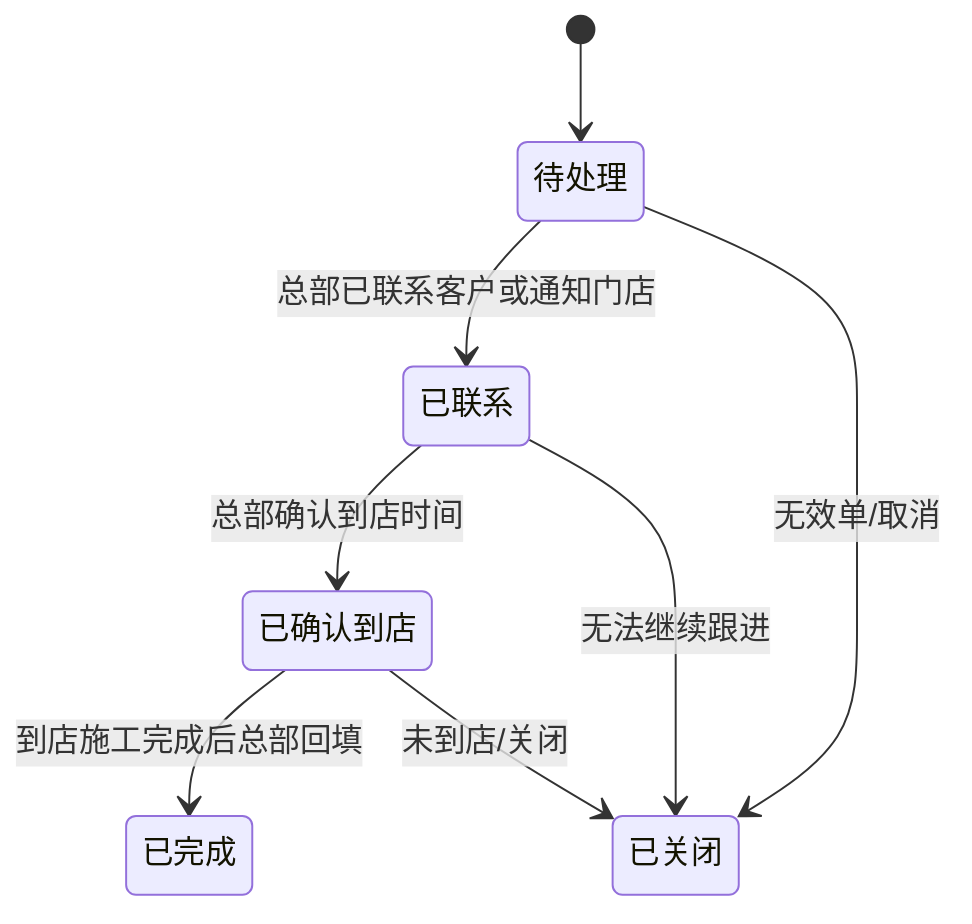
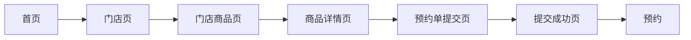
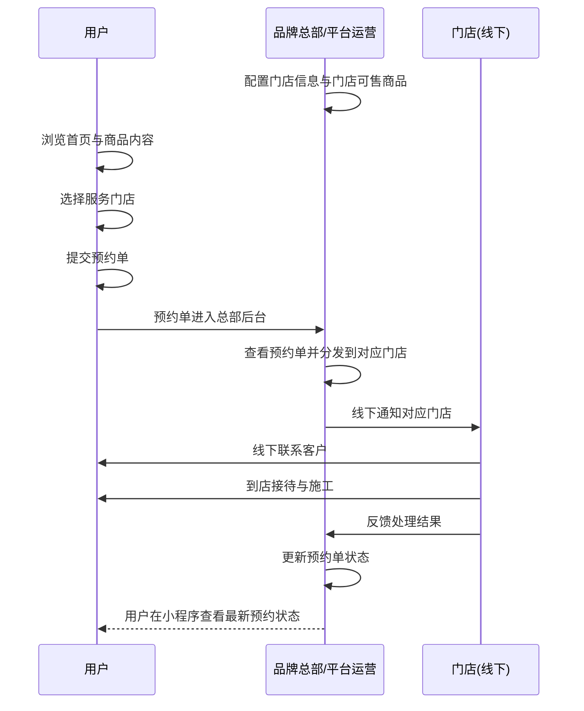

# 蓝辉轻改小程序需求文档 V5

## 1. 产品定位
- 本项目是一个`品牌 + 加盟商模式的预约到店型轻改装商城`。
- 本项目保留用户端小程序，用于展示项目、选择门店、提交预约。
- 本项目`不建设门店端后台`，第一阶段采用`总部集中代运营模式`。
- 总部统一维护门店信息、门店商品配置、预约单处理和状态更新。
- 门店在线下负责接待、施工、成交和售后，不作为系统登录角色存在。

### V5 核心判断
- 不做支付
- 不做门店后台
- 主对象是`预约单`
- 用户主流程是`线上看项目 -> 选门店 -> 提交预约 -> 总部转门店 -> 门店线下承接`
- 不同门店仍然保留不同商品和服务的展示差异

## 2. 当前业务流程

### 2.1 传统门店流程与新增线上渠道流程

| 阶段 | 传统贴膜店流程 | 新增线上渠道流程 |
|---|---|---|
| 用户来源 | 线下自然客流 / 口碑 | 抖音、小程序等线上流量导入 |
| 线上展示 | 项目介绍、案例 | 在线展示项目、套餐、案例 |
| 选择门店 | 到店后才选 | 用户先在线上选门店 |
| 接触门店 | 到店后才接触 | 用户提交预约后，由总部或门店线下联系 |
| 私域沉淀 | 部分老客户 | 线下联系后引导进入私域，主要用于预约后跟进和售后 |
| 成交 | 线下现场成交 | 线下门店成交施工 |
| 售后 | 线下或电话 | 私域内继续处理售后和复购 |

### 2.2 V5 业务判断
- 小程序继续按照`新增线上渠道流程`来设计。
- 用户在线上完成项目选择、门店选择和预约提交。
- 不建设门店后台，所有系统内操作由总部后台统一处理。
- 门店差异化能力保留在`门店商品配置`上，而不是保留一套门店系统。

## 3. 用户主流程
- 用户进入首页查看活动、热门项目、热门套餐、案例和门店入口。
- 用户先选择服务门店。
- 系统展示该门店已上架的商品和套餐。
- 用户查看商品详情或套餐详情。
- 用户在商品详情页直接发起预约。（也可以类似与购物车的模块 把商品添加到预约单中）
- 系统生成一笔预约单。
- 总部后台收到预约单，并按预约门店进行分发和线下通知。
- 门店线下联系客户，确认意向项目和到店时间，并引导进入私域。
- 用户到店后，门店完成接待、施工和成交。
- 总部后台统一回填预约单状态。

说明：
- 这是整个系统的主链路。
- 后续所有页面和功能，都必须服务这条主链路。

## 4. 底部导航结构
- 首页
- 分类
- 门店
- 预约
- 我的

说明：
- 不保留`购物车`，因为本期不做支付。
- 不再使用`咨询单`作为主入口，本期核心对象是预约单。

## 5. 首页
- 展示 banner
- 展示热门车型
- 展示热门商品
- 展示热门套餐
- 展示专题推荐
- 展示案例内容
- 展示门店入口
- 提供搜索入口
- 首页内容由总部后台配置
- 支持内容排序和上下线

### 首页在流程中的作用
- 出现在`用户主流程第 1 步`
- 使用人是`用户`
- 目标是让用户快速理解品牌、找到感兴趣项目、进入预约路径

## 6. 门店页 / 门店商品页

### 6.1 门店页（门店列表页）
- 用户必须先选择服务门店
- 门店页展示门店名称、地址、联系电话、营业时间
- 门店基础信息直接展示在门店卡片中
- 选择门店后，系统记住当前服务门店
- 点击`进店选购`后，进入该门店商品页

### 6.2 门店商品页
- 门店商品页核心逻辑是`先选门店，再看该门店可售项目`
- 页面只展示当前所选门店已上架商品和套餐
- 支持按品牌、车型、项目分类查看内容
- 分类包括内饰、外观、功能、舒适、套餐
- 列表展示项目图片、名称、价格说明、简要介绍
- 点击进入商品详情页或套餐详情页

### 门店页 / 门店商品页在流程中的作用
- 出现在`用户主流程第 2-3 步`
- 使用人是`用户`
- 目标是先让用户明确服务门店，再看到该门店真实可承接商品

## 7. 商品详情页
- 展示主图轮播
- 展示项目介绍
- 展示价格说明
- 展示适配车型
- 展示规格说明
- 展示当前门店信息
- 提供`加入预约单`入口

### 套餐说明
- 套餐详情页视为商品详情页的一种
- 套餐可包含多个标准化项目

### 商品详情页在流程中的作用
- 出现在`用户主流程第 4-5 步`
- 使用人是`用户`
- 目标是帮助用户做预约前决策，并直接发起预约

## 8. 预约单提交页
- 用户从商品详情页直接进入预约单提交页
- 提交时收集手机号
- 提交时收集车型
- 提交时收集所选门店
- 提交时收集意向项目
- 提交时收集到店时间（预约日期）
- 提交时收集备注信息（可选）
- 提交成功后生成一笔预约单
- 提交成功页提示总部或门店会尽快联系

### 预约单提交页在流程中的作用
- 出现在`用户主流程第 5-6 步`
- 使用人是`用户`
- 目标是把浏览意向转成总部可统一处理的预约单

## 9. 预约
- 用户可以查看自己的预约单列表
- 用户可以查看预约单状态
- 预约单状态包括：
  - 待处理
  - 已联系
  - 已确认到店
  - 已完成
  - 已关闭
- 用户可以查看所选门店信息
- 用户可以查看意向项目、提交时间、预约时间
- 用户可以查看联系提示

### 预约页在流程中的作用
- 出现在`用户主流程第 7-8 步`
- 使用人是`用户`
- 目标是让用户知道预约单当前处理到哪一步

## 10. 我的
- 保留微信登录
- 保留手机号绑定
- 展示用户基础信息
- 提供`我的预约`快捷入口
- 提供当前服务门店查看入口
- 提供联系总部入口
- 提供品牌介绍入口
- 提供用户协议和隐私政策入口

### 我的在流程中的作用
- 贯穿`用户预约前后`
- 使用人是`用户`
- 目标是让用户能够快速查看预约、联系总部，并承接私域和售后入口

## 11. 总部后台
- 管理角色权限
- 管理首页内容
- 管理车型库
- 管理商品库
- 管理套餐库
- 管理商品适配关系
- 管理套餐适配关系
- 管理加盟门店信息
- 配置不同门店可售项目
- 查看预约单列表
- 更新预约单状态
- 填写预约处理备注
- 查看汇总经营数据
- 统计访问量
- 统计预约单量
- 统计到店量
- 统计完成量

### 总部后台权限边界
- 总部维护标准商品库和品牌内容
- 总部维护门店信息
- 总部配置各门店可售商品和套餐
- 总部统一处理预约单和状态更新
- 总部不需要门店登录后台参与处理

### 总部后台在流程中的作用
- 出现在`日常准备阶段`和`预约单处理阶段`
- 使用人是`品牌总部/平台运营`
- 目标是以一套后台完成内容管理、门店管理和预约单管理

## 12. 角色划分
- 用户负责选择门店、浏览商品、提交预约、查看预约状态
- 品牌总部负责首页配置、车型、商品、套餐、适配关系、门店信息、门店商品配置、预约单处理、汇总数据
- 门店负责线下接待、施工、成交和售后，但不是系统登录角色

### 角色说明
- 当前版本不保留`销售角色`
- 当前版本不保留`门店后台`
- 当前版本不保留`店长/销售拆分`
- 当前版本不保留`门店内部认领机制`

## 13. 状态流转图

### 13.1 预约单状态流转图

### 13.2 用户预约路径图

### 13.3 角色协作流程图

## 15. 业务规则补充

### 15.1 商品规则
- 总部维护标准商品库
- 总部维护门店信息
- 总部配置每个门店可提供的商品和套餐
- 用户只能看到所选门店已配置的商品和服务

### 15.2 预约规则
- 用户预约的是指定门店的指定商品或套餐
- 提交成功后生成预约单
- 该预约单归属对应门店
- 预约单必填字段为：手机号、车型、门店、意向项目、到店时间
- 预约单可选字段为：备注

### 15.3 处理规则
- 总部后台是预约单唯一处理入口
- 门店线下处理客户，不通过系统登录处理
- 到店施工完成后，由总部统一回填预约单结果

### 15.4 私域规则
- 私域不是系统内页面
- 私域主要用于预约后跟进、售后、投诉、复购联系
- 第一阶段不在系统内实现私域聊天或售后工单
